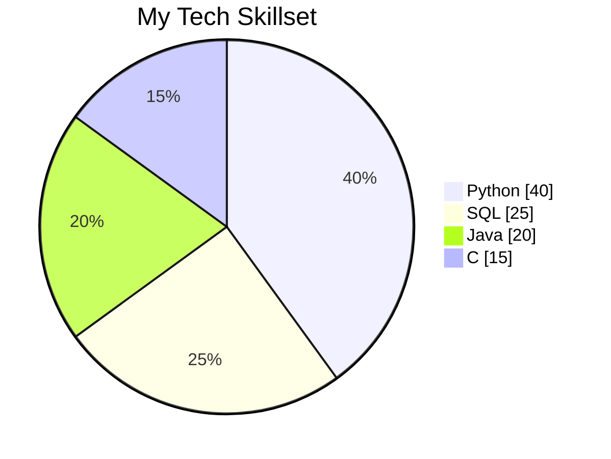

<h1 align="center">Hi 👋, I'm Ishan</h1>
<h3 align="center">💻 CS Undergrad | Full-Stack & ML | Building AI-Powered Systems 🚀</h3>

  
  &nbsp;&nbsp;
  

---

### 🧠 About Me

* 🎓 B.Tech in Computer Science @ ABESIT, Ghaziabad (2024–2028)
* 🤖 Interested in **Machine Learning, AI, and Full-Stack Development**
* 🔬 Ex-**ML Research Intern @ NIT Delhi**
* 🏆 **SIH26 Finalist** — Building solutions for real-world problems
* 🚀 Currently building **Dev OS**, my AI-powered developer workspace
* ⚙️ Focused on turning ideas into **practical, scalable applications**

---

### 🛠️ Tech Skills

---

### 🧰 Languages & Tools

  

---

### 🚀 Projects

* 🖥️ **[Dev OS](https://github.com/shan-771/dev-os)** — AI-powered developer workspace for managing projects, tasks, and development workflows.
* 🔐 **SIH26 — Secure Digital Document Management System** — Group project focused on secure document storage, search, integrity, and chain of custody.
* 🩺 **LVAM-Net** — Lightweight deep learning architecture for medical image segmentation, developed during my research work at NIT Delhi.

---

### 🏆 Experience & Achievements

* 🔬 **ML Research Intern @ NIT Delhi**
* 🏆 **Finalist — Smart India Hackathon 2026**

---

> *Building, learning, and shipping — one project at a time.* 🚀
